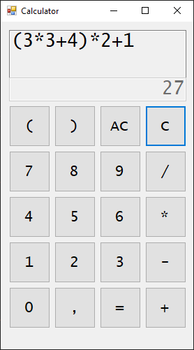

# A simple calculator with an arithmetic expression interpreter underneath

I was given an assignment to write a simple (Windows Forms) calculator app at my
University. I decided to make it a little bit more interesting and write a full-
fledged parser for evaluating arithmetic expressions.
It features a
- Lexer (tokenizer)
- Parser
- Interpreter
